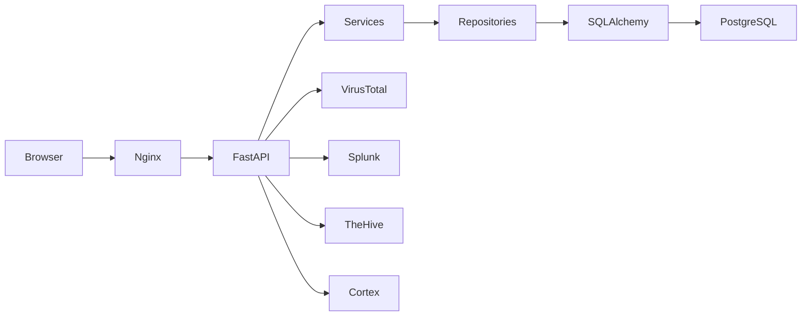

# IOC Platform Enterprise

> Threat Intelligence Platform • IOC Management • Incident Response

## Tabla de contenido
- Introducción
- Arquitectura
- Tecnologías
- Instalación
- API
- Roadmap
- Git Flow
- Troubleshooting

## Introducción
IOC Platform Enterprise es una plataforma para la administración de IOCs, Threat Intelligence y Respuesta a Incidentes.

## Arquitectura



## Tecnologías

|Componente|Tecnología|
|---|---|
|Backend|FastAPI|
|ORM|SQLAlchemy 2|
|DB|PostgreSQL|
|Frontend|HTML/CSS/JS|
|Contenedores|Docker|
|Proxy|Nginx|

## Estructura

```text
api/
collector/
database/
scheduler/
uploads/
exports/
docker-compose.yml
README.md
```

## Instalación

```bash
git clone <repo>
cd ioc-platform
docker compose up -d
```

## API

- GET /api/v2/iocs
- GET /api/v2/iocs/{id}
- GET /api/v2/iocs/dashboard

## Roadmap

- Dashboard Enterprise
- IOC Explorer
- IOC Detail
- Campaigns
- Threat Actors
- Malware
- MITRE ATT&CK
- Integraciones
- Graph Explorer

## Git Flow

```text
main
develop
enterprise-v2
feature/*
```

## Troubleshooting

```bash
docker compose ps
docker compose logs api
docker exec -it ioc-nginx nginx -T
```

## Licencia

Uso interno.
