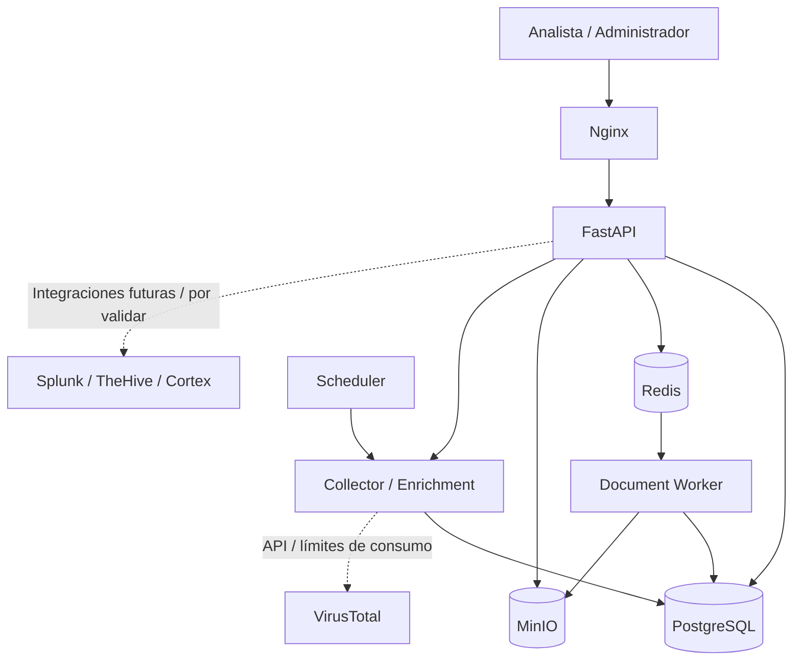

# IOC Platform Enterprise

> Plataforma interna de Threat Intelligence (TIP), gestión de indicadores de compromiso (IOC), enriquecimiento, análisis y soporte a respuesta a incidentes.

**Última actualización documental:** 2026-10-08  
**Directorio de despliegue:** `/opt/ioc-platform`  
**Estado:** plataforma en desarrollo; validar las configuraciones reales antes de su uso en producción.

## Contenido

1. [Objetivo y alcance](#objetivo-y-alcance)
2. [Arquitectura](#arquitectura)
3. [Servicios Docker](#servicios-docker)
4. [Estructura del proyecto](#estructura-del-proyecto)
5. [Funcionalidades implementadas](#funcionalidades-implementadas)
6. [Seguridad, autenticación y roles](#seguridad-autenticación-y-roles)
7. [API y endpoints](#api-y-endpoints)
8. [Operación diaria](#operación-diaria)
9. [Recuperación después de apagado o reinicio](#recuperación-después-de-apagado-o-reinicio)
10. [Diagnóstico y solución de problemas](#diagnóstico-y-solución-de-problemas)
11. [Respaldo y restauración](#respaldo-y-restauración)
12. [Pendientes y roadmap](#pendientes-y-roadmap)
13. [Seguridad operativa](#seguridad-operativa)

## Objetivo y alcance

Centralizar IOC (IP, dominio, URL y hash), enriquecerlos con fuentes de reputación, permitir su exploración y exportación, gestionar documentos de inteligencia y habilitar flujos posteriores de correlación, hunting y respuesta a incidentes. La integración efectiva de cada proveedor externo debe verificarse; una referencia en la arquitectura no implica que esté operativa.

## Arquitectura


```mermaid
flowchart TD
    U[Analista / Administrador] --> N[Nginx]
    N --> A[FastAPI]
    A --> DB[(PostgreSQL)]
    A --> R[(Redis)]
    A --> M[(MinIO)]
    A --> C[Collector / Enrichment]
    R --> W[Document Worker]
    W --> DB
    W --> M
    S[Scheduler] --> C
    C --> DB
    C -. API / límites de consumo .-> VT[VirusTotal]
    A -. Integraciones futuras / por validar .-> EXT[Splunk / TheHive / Cortex]
```

**Stack:** Python 3.12, FastAPI, SQLAlchemy 2, PostgreSQL 16, Redis, MinIO, Docker Compose, Nginx y frontend Vue 3/Vite en desarrollo. Se emplean Argon2id para contraseñas y JWT para sesiones.

## Servicios Docker

Los siguientes nombres se han utilizado en el entorno. Verificar nombres y servicios vigentes con `sudo docker compose ps` y `sudo docker compose config --services`.

| Contenedor | Función |
|---|---|
| `ioc-nginx` | Proxy de acceso |
| `ioc-api` | API FastAPI y reglas de negocio |
| `ioc-postgres` | Persistencia relacional |
| `ioc-redis` | Cola y servicios auxiliares |
| `ioc-minio` | Almacenamiento de documentos/objetos |
| `ioc-collector` | Ingesta y enriquecimiento IOC |
| `ioc-scheduler` | Programación de tareas |
| `ioc-document-worker` | Procesamiento asíncrono de documentos |
| `ioc-adminer` | Administración de base de datos; restringir acceso |

La pila TheHive/Cortex es independiente y **no debe confundirse** con este Compose. Levantarla desde su propio directorio y archivo de configuración, si se requiere.

## Estructura del proyecto

```text
/opt/ioc-platform/
├── .env                     # secretos y configuración; no subir a Git
├── docker-compose.yml
├── README.md
├── api/
│   ├── main.py
│   ├── config.py
│   ├── database.py
│   ├── core/security/
│   ├── modules/auth/
│   ├── modules/audit/
│   ├── modules/iocs/
│   ├── modules/dashboard/
│   ├── modules/documents/
│   └── routes/
├── collector/
├── scheduler/
├── workers/
├── database/migrations/
├── frontend/
├── uploads/
├── docs/
└── logs/                    # si existe según montaje
```

## Funcionalidades implementadas

### IOC y Dashboard

- Consulta, conteo, detalle y exportación de IOC.
- Dashboard y métricas de IOC.
- Ingesta de archivos y enriquecimiento con VirusTotal.
- Operaciones de control de enriquecimiento: iniciar, pausar, reanudar, cancelar, reintentar errores y consultar eventos/estado.
- Respetar el límite de API de VirusTotal según la modalidad contratada (se utilizó 4 consultas/minuto en pruebas).

### Document Center

- Carga, listado, consulta y descarga de documentos.
- Cálculo de hashes SHA-256 y MD5.
- Almacenamiento de archivos en MinIO y metadatos en PostgreSQL.
- Cola Redis y worker con estados `QUEUED`, `PROCESSING` y `PROCESSED`.
- En pruebas previas se verificó la integridad de una descarga comparando SHA-256.

### Usuarios, sesiones y auditoría

- Registro inicial de administrador mediante bootstrap.
- Usuarios `ADMIN` y `ANALYST` con relación usuario-rol.
- Contraseñas Argon2id, JWT de acceso, refresh tokens persistidos como hash SHA-256 y rotación de refresh.
- Bloqueo temporal tras intentos fallidos, cierre de sesión y cambio de contraseña.
- Auditoría de eventos de seguridad en PostgreSQL y archivo de log.
- Alta de usuarios mediante API exclusiva para ADMIN.
- Contraseña temporal obligatoria: el usuario puede autenticarse y cambiar su contraseña, pero no utilizar módulos productivos hasta hacerlo.

## Seguridad, autenticación y roles

### Política de acceso

| Recurso | Sin sesión | ANALYST (contraseña definitiva) | ADMIN (contraseña definitiva) |
|---|---|---|---|
| `GET /health` | Sí | Sí | Sí |
| Login | Sí | Sí | Sí |
| `/api/v1/auth/me` | No | Sí | Sí |
| Cambio de contraseña | No | Sí | Sí |
| Dashboard / IOC / Enrichment / Documents | No | Sí | Sí |
| `POST /api/v1/admin/users` | No | No | Sí |

Los endpoints productivos se protegieron desde `api/main.py` mediante `Depends(require_password_changed)` en `app.include_router(...)`. Los endpoints administrativos usan `require_roles("ADMIN")`, que también valida la obligación de cambiar contraseña.

**Pruebas verificadas:** ANALYST con contraseña temporal obtuvo `403` en Document Center; después del cambio (`204`) y nuevo login obtuvo `200`; la prueba ADMIN con ANALYST obtuvo `403`. Los endpoints temporales `/admin-test` y `/platform-test` fueron eliminados del inventario OpenAPI.

**Pendiente de verificación integral:** ejecutar la auditoría de todos los endpoints sin token, incluyendo los métodos que modifican estado; revisar permisos de documentación `/docs`, `/redoc` y `/openapi.json`; probar expiración y revocación de tokens y el comportamiento del frontend.

**Parámetros de referencia** (confirmar `.env` y `docker-compose.yml`, sin imprimir secretos):

| Variable | Valor usado |
|---|---|
| `ACCESS_TOKEN_MINUTES` | `15` |
| `REFRESH_TOKEN_DAYS` | `7` |
| `MAX_LOGIN_ATTEMPTS` | `5` |
| `ACCOUNT_LOCK_MINUTES` | `15` |
| `JWT_SECRET_KEY` | Secreto; nunca documentar el valor |
| `AUDIT_LOG_FILE` | `/app/logs/audit.log` |

## API y endpoints

Inventario observado en OpenAPI (34 operaciones, al cierre de la etapa de seguridad):

```text
GET     /api/analysis/history
POST    /api/enrichment/virustotal/cancel
GET     /api/enrichment/virustotal/events
DELETE  /api/enrichment/virustotal/events
POST    /api/enrichment/virustotal/pause
POST    /api/enrichment/virustotal/resume
POST    /api/enrichment/virustotal/retry-errors
POST    /api/enrichment/virustotal/start
GET     /api/enrichment/virustotal/status
GET     /api/enrichment/virustotal/summary
GET     /api/iocs
GET     /api/iocs/export
GET     /api/iocs/malicious
GET     /api/stats
GET     /api/stats/overview
GET     /api/templates/ioc-enterprise
POST    /api/upload
POST    /api/v1/admin/users
POST    /api/v1/auth/change-password
POST    /api/v1/auth/login
POST    /api/v1/auth/logout
GET     /api/v1/auth/me
POST    /api/v1/auth/refresh
GET     /api/v2/dashboard
GET     /api/v2/iocs
GET     /api/v2/iocs/count
GET     /api/v2/iocs/dashboard
GET     /api/v2/iocs/{ioc_id}
GET     /api/v2/iocs/{ioc_id}/details
POST    /api/v3/documents
GET     /api/v3/documents
GET     /api/v3/documents/{document_id}
GET     /api/v3/documents/{document_id}/download
GET     /health
```

Para consultar la definición vigente:

```bash
curl -fsS http://localhost:8000/openapi.json -o /tmp/ioc-openapi.json
python3 -m json.tool /tmp/ioc-openapi.json >/dev/null && echo 'OpenAPI válido'
```

**Nota:** algunas rutas v2 tienen prefijos compartidos entre distintos routers; revisar el orden de registro y posibles colisiones al modificar endpoints.

## Operación diaria

```bash
cd /opt/ioc-platform
sudo docker compose ps
sudo docker compose logs --tail=80 api
curl -i --max-time 10 http://localhost:8000/health
```

`/health` es una comprobación de la API, no garantiza por sí sola que PostgreSQL, Redis, MinIO y workers funcionen. Validar también flujos reales de lectura y procesamiento.

## Recuperación después de apagado o reinicio

> **Runbook operativo.** Utilizar después de apagado eléctrico, reinicio de Linux o caída del servicio Docker. No ejecutar `docker compose down -v`, `docker volume prune`, `docker system prune --volumes` ni borrar directorios de datos como método de recuperación.

### Paso 1. Comprobar que Linux y el almacenamiento están disponibles

Acceder al servidor por consola o SSH:

```bash
whoami
hostname
uptime
df -h
ls -la /opt/ioc-platform/docker-compose.yml
```

Si `/opt/ioc-platform` está en un disco o montaje separado, comprobar que esté montado antes de iniciar contenedores. No arrancar servicios de base de datos contra directorios vacíos creados por un montaje ausente.

### Paso 2. Levantar el servicio Docker

```bash
sudo systemctl status docker --no-pager
sudo systemctl start docker
sudo systemctl enable docker
sudo docker info >/dev/null && echo 'Docker operativo'
```

Si Docker no inicia:

```bash
sudo journalctl -u docker -b --no-pager -n 100
```

### Paso 3. Recuperar la plataforma

```bash
cd /opt/ioc-platform
sudo docker compose config --quiet
sudo docker compose up -d --no-build
```

`up -d --no-build` utiliza imágenes existentes y no reconstruye la aplicación. Si una imagen falta, diagnosticar primero; no actualizar imágenes indiscriminadamente durante una recuperación. `up` puede recrear contenedores si detecta diferencias de configuración; revisar cambios antes de ejecutarlo en un entorno crítico.

Si los contenedores existentes simplemente están detenidos y no hubo cambios de configuración, también puede utilizarse:

```bash
sudo docker compose start
```

### Paso 4. Verificar servicios y dependencias

```bash
sudo docker compose ps
sudo docker compose ps -a
sudo docker compose logs --tail=100 postgres redis minio api
sudo docker compose logs --tail=100 collector scheduler document-worker
```

Los nombres de servicio de Compose pueden diferir de los nombres de contenedor. Si algún comando indica `no such service`, ejecutar `sudo docker compose config --services` y usar los nombres reales.

Para revisar un contenedor concreto:

```bash
sudo docker logs --tail=100 ioc-api
sudo docker logs --tail=100 ioc-postgres
sudo docker logs --tail=100 ioc-document-worker
```

Si un contenedor está en `Restarting`, revisar logs antes de reiniciarlo repetidamente.

### Paso 5. Validar que la API volvió

```bash
curl -sS --max-time 10 -o /dev/null -w 'Health HTTP: %{http_code}\n' http://localhost:8000/health
curl -sS --max-time 10 -o /dev/null -w 'OpenAPI HTTP: %{http_code}\n' http://localhost:8000/openapi.json
```

Resultado esperado en la configuración de desarrollo: `200` para ambos. Si la API tarda en iniciar, esperar a que PostgreSQL y los servicios auxiliares estén disponibles y revisar logs. Un `401` en `/api/v3/documents` sin JWT es **correcto**: confirma que la ruta exige autenticación.

### Paso 6. Validación funcional después del reinicio

1. Iniciar sesión con una cuenta autorizada; no pegar contraseñas ni tokens en tickets o chats.
2. Abrir Dashboard y consultar métricas de IOC.
3. Consultar el listado de IOC y Document Center.
4. Verificar que el worker procese trabajos nuevos; revisar si quedaron tareas pendientes tras la caída.
5. Comprobar que scheduler y collector estén activos y que no haya reintentos duplicados.
6. Revisar el log de auditoría y errores recientes.
7. Registrar hora de recuperación, causa, servicios afectados y resultado.

### Paso 7. Habilitar recuperación automática en futuros reinicios

Comprobar las políticas actuales:

```bash
cd /opt/ioc-platform
sudo docker compose ps -q | xargs -r sudo docker inspect --format '{{.Name}} -> {{.HostConfig.RestartPolicy.Name}}'
```

Configurar `restart: unless-stopped` en cada servicio persistente del `docker-compose.yml` cuando sea apropiado, y aplicar el cambio en una ventana controlada:

```yaml
services:
  api:
    restart: unless-stopped
  postgres:
    restart: unless-stopped
```

*Fragmento ilustrativo, no sustituye el Compose completo.* Verificar también dependencias, healthchecks, persistencia y arranque ordenado. `restart: unless-stopped` **no garantiza** que la aplicación esté lista ni reinicia contenedores que fueron detenidos manualmente antes del reinicio del daemon.

### Paso 8. Si no se recupera

```bash
sudo docker compose config --services
sudo docker compose ps -a
sudo docker compose logs --tail=200 api
sudo journalctl -u docker -b --no-pager -n 100
free -h
df -h
```

No ejecutar migraciones, recrear volúmenes ni restaurar respaldos sin identificar la causa y contar con una copia de seguridad verificada.

## Diagnóstico y solución de problemas

| Síntoma | Primera comprobación | Acción segura |
|---|---|---|
| Docker detenido | `systemctl status docker` | `systemctl start docker` |
| API no responde | `docker compose ps` y logs `api` | Revisar dependencias y errores Python |
| PostgreSQL no inicia | Logs de `ioc-postgres`, disco y montajes | Verificar volumen y permisos; no borrar datos |
| Nginx devuelve 502 | Logs `ioc-nginx` y `ioc-api` | Comprobar conectividad entre servicios |
| Jobs atascados | Logs de Redis y document-worker | Investigar cola y reintentos antes de relanzar |
| IOC sin enriquecer | Logs collector/scheduler y límites VT | Revisar errores y tasa de consultas |
| Login falla | API, usuario activo y auditoría | Revisar bloqueo de cuenta sin exponer secretos |
| Documentos no descargan | MinIO, DB, API y permisos | Verificar objeto y metadatos |

## Respaldo y restauración

**No hay evidencia aquí de un procedimiento de backup/restauración integral ya probado.** Antes de operar como plataforma crítica, implementar y probar:

- Respaldo consistente de PostgreSQL (usuarios, IOC, auditoría y metadatos).
- Respaldo de objetos de MinIO y directorios persistentes.
- Respaldo protegido de `docker-compose.yml`, configuraciones, migraciones y secretos de `.env` (estos últimos cifrados y con acceso restringido).
- Copia externa o fuera del servidor, retención, integridad y restauración de prueba.
- Objetivos documentados de RPO/RTO y responsables de recuperación.

Nunca subir `.env`, dumps de base de datos ni tokens al repositorio público.

## Pendientes y roadmap

**Validado parcialmente / en evolución:** autenticación, RBAC, auditoría, administración básica de usuarios, IOC, Dashboard, Document Center y enriquecimiento.

**Siguientes etapas:**

- Auditoría automática completa de acceso anónimo y permisos por endpoint.
- Endurecimiento de refresh tokens, sesiones y revocación.
- Login frontend Vue 3, Pinia, Axios y guards por rol/cambio obligatorio.
- Gestión administrativa: listado, activación, desactivación y asignación de roles.
- Visor de auditoría ADMIN.
- Extracción de IOC desde documentos, OCR cuando proceda, correlación y campañas.
- Threat Actors, Malware, MITRE ATT&CK, Graph Explorer e integraciones externas verificadas.
- Healthchecks y recuperación automática comprobada con simulacro de reinicio.
- Backup y restauración integral probados.

## Seguridad operativa

- Exponer la plataforma solo a redes autorizadas y usar TLS en producción.
- Restringir Adminer, Redis, PostgreSQL, MinIO y endpoints administrativos.
- Mantener los secretos fuera de Git; rotar credenciales expuestas.
- Evitar registrar passwords, JWT y tokens en logs.
- Aplicar mínimo privilegio y separar el entorno de pentesting del entorno TIP productivo.
- Ejecutar actualizaciones y migraciones con respaldo previo y plan de reversión.
- Verificar que el frontend no sea la única capa de autorización: los controles deben estar en backend.

## Git Flow y licencia

Ramas propuestas: `main`, `develop`, `enterprise-v2` y `feature/*`. Ajustar a la política del repositorio.  
**Licencia/uso:** interno; verificar los términos aplicables antes de distribución.
